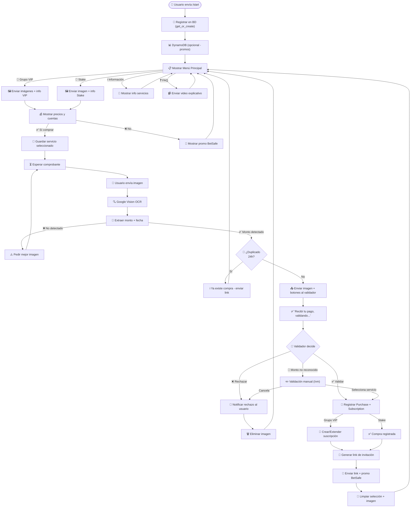
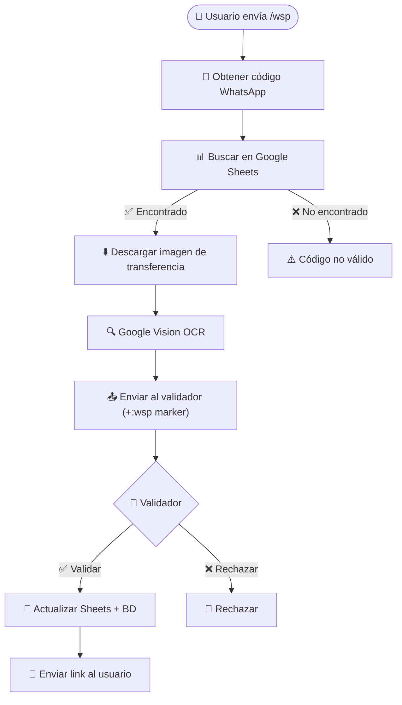
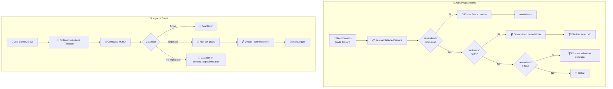
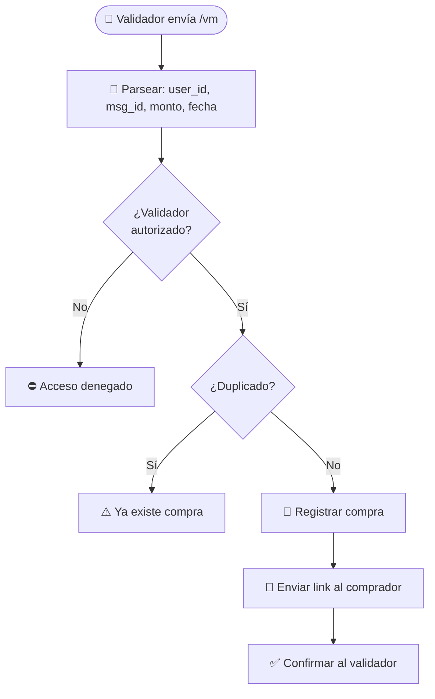
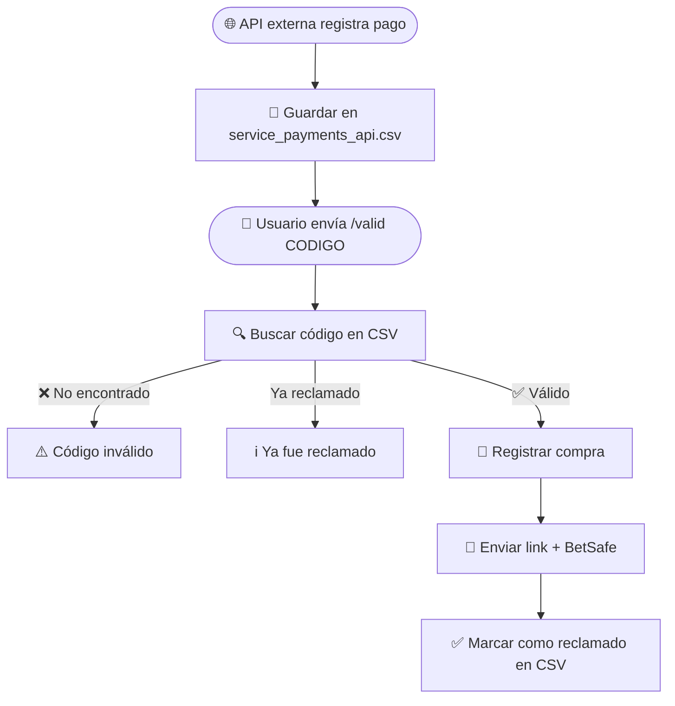
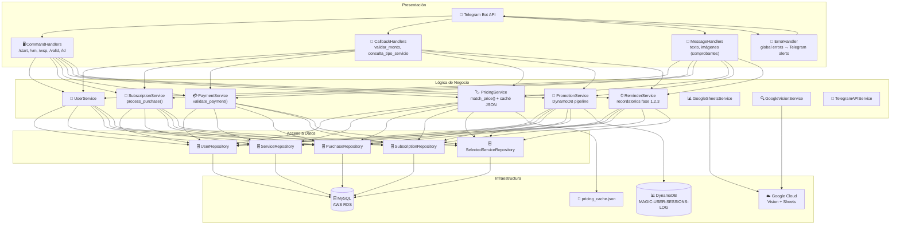

# 🔄 Flujo Conversacional - Magic Chatbot v2

## Diagrama Principal

## Flujo WhatsApp (WSP)

## Pipeline de Jobs Programados

## Validación Manual (/vm)

## Flujo API Externa (/valid)

---

## 📊 Arquitectura de Capas

---

## 📋 Resumen de Comandos

| Comando | Quién | Qué hace |
|---------|-------|----------|
| `/start` | Usuario | Registro + menú principal |
| `/vm uid mid monto [fecha]` | Validador | Validar monto manualmente |
| `/wsp codigo` | Usuario WSP | Registrar pago WhatsApp |
| `/valid codigo` | Usuario | Reclamar compra API externa |
| `/id` | Validador | Ver su Telegram ID |
| `/help` | Usuario | Ayuda → redirige a /start |